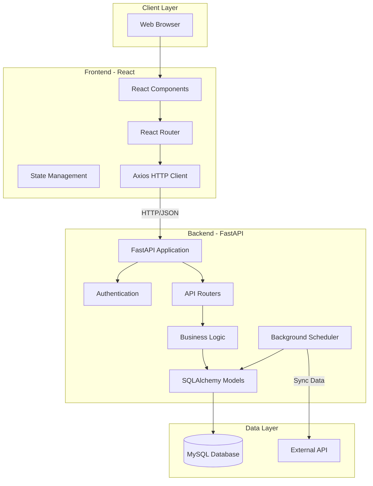
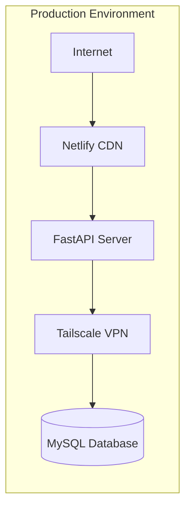

SESA (Sistema de Evaluación y Seguimiento Académico) is built on a modern three-tier architecture designed for scalability, maintainability, and performance.

## High-Level Overview



## Technology Stack

### Frontend Architecture

**React 19 + Vite + Tailwind CSS**

The frontend is a modern single-page application (SPA) built with:

- **React 19**: Latest version for UI components with improved performance
- **Vite 7**: Lightning-fast build tool and dev server
- **Tailwind CSS 4**: Utility-first CSS framework for responsive design
- **React Router 7**: Client-side routing and navigation
- **Axios**: HTTP client for API communication

```javascript
// Frontend API Client Configuration
// frontend/src/lib/axios.js
import axios from 'axios';

const client = axios.create({
  baseURL: import.meta.env.VITE_API_URL,
});

export default client;
```

<Note>
  The frontend connects to the backend via environment variable `VITE_API_URL`, making it easy to switch between development and production endpoints.
</Note>

### Backend Architecture

**FastAPI + SQLAlchemy + MySQL**

The backend is a high-performance REST API built with:

- **Python 3.14**: Latest Python for modern language features
- **FastAPI**: Modern, fast web framework with automatic API documentation
- **SQLAlchemy**: Powerful ORM for database operations
- **PyMySQL**: MySQL database driver
- **APScheduler**: Background task scheduler for data synchronization
- **Bcrypt**: Secure password hashing

## Backend Structure

The backend follows a clean, modular architecture:

```
backend/app/
├── main.py              # Application entry point
├── core/                # Core functionality
│   ├── config.py       # Environment configuration
│   └── security.py     # Password hashing & verification
├── db/                  # Database layer
│   └── database.py     # Connection & session management
├── models/              # SQLAlchemy ORM models
│   ├── user.py
│   ├── teacher.py
│   ├── subject.py
│   └── academic_group.py
├── schemas/             # Pydantic request/response schemas
│   └── auth.py
├── routers/             # API route handlers
│   ├── auth.py         # Authentication endpoints
│   ├── students.py     # Student management
│   ├── catalogos.py    # Catalogs
│   ├── Listados.py     # Reports and listings
│   ├── sync.py         # Data synchronization
│   └── mock_api.py     # Mock external API
└── services/            # Business logic layer
```

### Application Bootstrap

The FastAPI application initializes with lifecycle management:

```python
# backend/app/main.py
from contextlib import asynccontextmanager
from fastapi import FastAPI
from fastapi.middleware.cors import CORSMiddleware
from apscheduler.schedulers.background import BackgroundScheduler

@asynccontextmanager
async def lifespan(app: FastAPI):
    # Startup: Initialize background scheduler
    scheduler = BackgroundScheduler()
    scheduler.add_job(tarea_automatica_sincronizacion, 'interval', minutes=1)
    scheduler.start()
    print("Cronjob de Sincronización Iniciado (Corriendo cada 1 minuto)")

    # Verify database connection
    try:
        with engine.connect() as connection:
            connection.execute(text("SELECT 1"))
        print("\n¡CONEXIÓN A BASE DE DATOS EXITOSA!\n")
    except Exception as e:
        print(f"\nERROR AL CONECTAR A LA BD: {e}\n")

    yield  # Application runs here

    # Shutdown: Stop scheduler
    scheduler.shutdown()
    print("Cronjob de Sincronización Detenido")

app = FastAPI(
    title="SESA API",
    version="1.0.0",
    lifespan=lifespan
)
```

<Note>
  The `lifespan` context manager ensures proper startup and shutdown of background tasks, including the data synchronization scheduler.
</Note>

### CORS Configuration

CORS is configured to allow cross-origin requests from the frontend:

```python
# backend/app/main.py
import os

# Read CORS origins from environment or use defaults
origins_env = os.getenv("BACKEND_CORS_ORIGINS", "")
origins = [o.strip() for o in origins_env.split(",") if o.strip()]

if not origins:
    origins = [
        "http://localhost:5173",
        "http://127.0.0.1:5173",
        "http://localhost:5174",
        "http://127.0.0.1:5174",
    ]

app.add_middleware(
    CORSMiddleware,
    allow_origins=origins,
    allow_credentials=True,
    allow_methods=["*"],
    allow_headers=["*"],
)
```

### API Routers

Routers organize endpoints by functionality:

```python
# backend/app/main.py
from app.routers.students import router as students_router
from app.routers import Listados, auth, mock_api, sync, catalogos

app.include_router(students_router)
app.include_router(Listados.router)
app.include_router(auth.router)
app.include_router(mock_api.router)
app.include_router(sync.router)
app.include_router(catalogos.router)

@app.get("/")
def read_root():
    return {"message": "El sistema SESA está funcionando"}
```

Each router handles a specific domain:
- **auth**: User authentication and password management
- **students**: Student CRUD operations and academic tracking
- **catalogos**: System catalogs (roles, careers, etc.)
- **Listados**: Reports and data listings
- **sync**: Background data synchronization from external systems
- **mock_api**: Mock external API for testing

## Database Layer

### Connection Management

```python
# backend/app/db/database.py
from sqlalchemy import create_engine
from sqlalchemy.orm import sessionmaker, declarative_base
from app.core.config import DATABASE_URL

engine = create_engine(
    DATABASE_URL,
    pool_pre_ping=True  # Verify connections before using
)

SessionLocal = sessionmaker(autocommit=False, autoflush=False, bind=engine)

Base = declarative_base()

def get_db():
    """Dependency for database sessions"""
    db = SessionLocal()
    try:
        yield db
    finally:
        db.close()
```

<Note>
  The `pool_pre_ping=True` setting ensures connections are valid before use, automatically reconnecting if the database connection was lost.
</Note>

### Configuration

Database credentials are loaded from environment variables:

```python
# backend/app/core/config.py
import os
from dotenv import load_dotenv

load_dotenv()

DB_USER = os.getenv("MYSQL_USER")
DB_PASSWORD = os.getenv("MYSQL_PASSWORD")
DB_SERVER = os.getenv("MYSQL_SERVER")
DB_PORT = os.getenv("MYSQL_PORT")
DB_NAME = os.getenv("MYSQL_DB")

DATABASE_URL = f"mysql+pymysql://{DB_USER}:{DB_PASSWORD}@{DB_SERVER}:{DB_PORT}/{DB_NAME}"
```

### ORM Models

SQLAlchemy models define the database schema:

```python
# backend/app/models/user.py
from sqlalchemy import Column, String, BigInteger, Boolean, Integer, ForeignKey, TIMESTAMP, text
from sqlalchemy.orm import relationship
from app.db.database import Base

class User(Base):
    __tablename__ = "users"

    id = Column(BigInteger, primary_key=True, autoincrement=True)
    identifier = Column(String(50), nullable=False, unique=True)
    email = Column(String(150), nullable=False, unique=True)
    password_hash = Column(String(255), nullable=False)
    role_id = Column(Integer, ForeignKey("roles.id"), nullable=False)
    is_temp_password = Column(Boolean, server_default=text("TRUE"))
    created_at = Column(TIMESTAMP, server_default=text("CURRENT_TIMESTAMP"))
    last_login = Column(TIMESTAMP, nullable=True)

    role = relationship("Role")
```

## Security Architecture

### Password Security

SESA uses bcrypt for password hashing with salt:

```python
# backend/app/core/security.py
import bcrypt

def get_password_hash(password: str) -> str:
    """Hash password with bcrypt"""
    pwd_bytes = password.encode('utf-8')
    salt = bcrypt.gensalt()
    hashed = bcrypt.hashpw(pwd_bytes, salt)
    return hashed.decode('utf-8')

def verify_password(plain_password: str, hashed_password: str) -> bool:
    """Verify password against hash"""
    try:
        pwd_bytes = plain_password.encode('utf-8')
        hash_bytes = hashed_password.encode('utf-8')
        return bcrypt.checkpw(pwd_bytes, hash_bytes)
    except Exception:
        return False
```

### Authentication Flow

```python
# backend/app/routers/auth.py
from fastapi import APIRouter, Depends, HTTPException
from sqlalchemy.orm import Session
from sqlalchemy import or_
from datetime import datetime

router = APIRouter(prefix="/auth", tags=["auth"])

@router.post("/login", response_model=UserResponse)
def login(data: LoginRequest, db: Session = Depends(get_db)):
    # Support login by identifier or email
    user = (
        db.query(User)
        .filter(or_(User.identifier == data.identifier, User.email == data.identifier))
        .first()
    )

    if not user:
        raise HTTPException(status_code=401, detail="ID o contraseña incorrectos")

    if not verify_password(data.password, user.password_hash):
        raise HTTPException(status_code=401, detail="ID o contraseña incorrectos")

    # Update last login timestamp
    user.last_login = datetime.utcnow()
    db.commit()
    db.refresh(user)

    return user
```

<Note>
  The authentication system supports login via both user identifier and email address for flexibility.
</Note>

### Password Change Flow

Forced password change on first login:

```python
# backend/app/routers/auth.py
@router.put("/change-password")
def change_password(data: PasswordChangeRequest, db: Session = Depends(get_db)):
    user = db.query(User).filter(User.identifier == data.identifier).first()
    if not user:
        raise HTTPException(status_code=404, detail="Usuario no encontrado")

    # Verify current password
    if not verify_password(data.current_password, user.password_hash):
        raise HTTPException(status_code=400, detail="La contraseña actual es incorrecta")

    # Confirm new password matches
    if data.new_password != data.confirm_password:
        raise HTTPException(status_code=400, detail="Las contraseñas no coinciden")

    # Prevent reusing same password
    if verify_password(data.new_password, user.password_hash):
        raise HTTPException(status_code=400, detail="La nueva contraseña no puede ser igual a la actual")

    # Update password and remove temp flag
    user.password_hash = get_password_hash(data.new_password)
    user.is_temp_password = False

    db.commit()
    return {"message": "Contraseña actualizada exitosamente"}
```

## Background Data Synchronization

SESA automatically synchronizes data from external systems:

```python
# backend/app/routers/sync.py (excerpt)
from apscheduler.schedulers.background import BackgroundScheduler
import requests

URL_API_DOCENTES = "http://127.0.0.1:8000/api-externa-mock/carga-academica"

def tarea_automatica_sincronizacion():
    """Background task that runs every minute to sync data"""
    db = SessionLocal()
    try:
        respuesta = requests.get(URL_API_DOCENTES)
        if respuesta.status_code != 200:
            print("❌ Error: API de Docentes no disponible")
            return

        datos = respuesta.json()
        
        for item in datos:
            # Sync teachers
            docente = db.query(Teacher).filter(
                Teacher.external_id == item["ID_Docente"]
            ).first()
            if not docente:
                docente = Teacher(
                    external_id=item["ID_Docente"],
                    nombre=item["Nombre_Docente"],
                    apellido_paterno=item["Apellido_Paterno"],
                    apellido_materno=item["Apellido_Materno"]
                )
                db.add(docente)
                db.commit()
            
            # Sync subjects and groups...
            # (Additional sync logic)
            
    finally:
        db.close()
```

<Warning>
  The background scheduler runs every minute. Adjust the interval in `main.py` based on your data synchronization needs and external API rate limits.
</Warning>

## API Documentation

FastAPI automatically generates interactive API documentation:

- **Swagger UI**: `http://localhost:8000/docs`
- **ReDoc**: `http://localhost:8000/redoc`
- **OpenAPI JSON**: `http://localhost:8000/openapi.json`

## Deployment Architecture



### Production Stack

- **Frontend**: Hosted on Netlify with continuous deployment
- **Backend**: FastAPI server running on Python 3.14+
- **Database**: MySQL with Tailscale Mesh VPN for secure access
- **Networking**: Tailscale for encrypted connections between services

## Performance Considerations

### Database Connection Pooling

SQLAlchemy's connection pool manages database connections efficiently:
- Reuses connections instead of creating new ones
- `pool_pre_ping` validates connections before use
- Automatic cleanup of stale connections

### Background Task Optimization

The synchronization scheduler:
- Runs asynchronously without blocking API requests
- Configurable interval (default: 1 minute)
- Graceful shutdown on application stop

### Frontend Performance

- **Code Splitting**: React Router enables automatic code splitting
- **Hot Module Replacement**: Vite provides instant updates during development
- **Optimized Builds**: Production builds are minified and tree-shaken

## Monitoring and Logging

Current logging includes:
- Database connection status on startup
- CORS origins configuration
- Background scheduler status
- API endpoint access (via FastAPI)

<Note>
  For production deployments, consider adding structured logging, error tracking (e.g., Sentry), and performance monitoring (e.g., New Relic, DataDog).
</Note>

## Scalability

SESA's architecture supports horizontal scaling:

1. **Frontend**: Static files can be served from CDN (Netlify)
2. **Backend**: Stateless API can run multiple instances behind a load balancer
3. **Database**: MySQL supports replication for read scaling
4. **Background Jobs**: APScheduler can be replaced with distributed task queue (Celery, RQ) for multi-instance deployments

## Next Steps

- Review individual [API endpoints](/api/auth/login) documentation
- Learn about [database schema](/development/database-schema) and relationships
- Explore [frontend structure](/development/frontend-structure) and routing
- Review [development setup](/development/setup) procedures