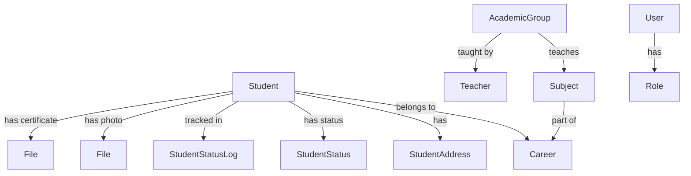

## Overview

SESA uses **MySQL** as the relational database with **SQLAlchemy ORM** for data modeling. The database is designed to manage students, users, academic programs, and institutional data.

## Entity Relationship Diagram

The database consists of 13 main tables organized into the following domains:

- **Student Management**: students, student_addresses, student_status, student_status_logs
- **User Authentication**: users, roles, administrators
- **Academic Structure**: careers, subjects, teachers, academic_groups
- **Supporting Data**: origin_schools, files

## Core Models

### Students

The primary entity representing enrolled students.

```python app/models/student.py
from sqlalchemy import Column, String, Integer, BigInteger, ForeignKey, TIMESTAMP, text
from sqlalchemy.orm import relationship
from app.db.database import Base

class Student(Base):
    __tablename__ = "students"

    matricula = Column(String(20), primary_key=True, index=True)
    
    nombre = Column(String(100), nullable=False)
    apellido_paterno = Column(String(100), nullable=False)
    apellido_materno = Column(String(100), nullable=False)
    curp = Column(String(18), nullable=False, unique=True)
    foto_id = Column(BigInteger, ForeignKey("files.id"), nullable=True)
    email_personal = Column(String(150), nullable=False)
    email_institucional = Column(String(150), nullable=True)
    origin_school_id = Column(Integer, ForeignKey("origin_schools.id"), nullable=True)
    promedio_procedencia = Column(Integer, nullable=False)
    certificado_id = Column(BigInteger, ForeignKey("files.id"), nullable=True)
    career_id = Column(Integer, ForeignKey("careers.id"), nullable=False)
    cuatrimestre_actual = Column(Integer, nullable=False, server_default=text("1"))
    status_id = Column(Integer, ForeignKey("student_statuses.id"), nullable=False, server_default=text("1"))
    created_at = Column(TIMESTAMP, server_default=text("CURRENT_TIMESTAMP"))
    updated_at = Column(TIMESTAMP, server_default=text("NULL ON UPDATE CURRENT_TIMESTAMP"), nullable=True)
    
    # Relationships
    career = relationship("Career")
    status = relationship("StudentStatus")
    foto = relationship("File", foreign_keys=[foto_id])
    certificado = relationship("File", foreign_keys=[certificado_id])
```

**Key Fields:**
- `matricula` (PK): Unique student ID (20 chars)
- `curp`: Mexican national ID (18 chars, unique)
- `foto_id`, `certificado_id`: Foreign keys to `files` table for documents
- `career_id`: Links to academic program
- `status_id`: Current enrollment status (active, inactive, graduated, etc.)
- `cuatrimestre_actual`: Current semester/quarter

**Relationships:**
- One-to-One with `student_addresses`
- Many-to-One with `careers`, `student_statuses`, `origin_schools`
- Many-to-One with `files` (multiple foreign keys for different documents)

### Student Addresses

Contact information for students.

```python app/models/student_addresses.py
from sqlalchemy import Column, String, BigInteger, ForeignKey, text
from app.db.database import Base

class StudentAddress(Base):
    __tablename__ = "student_addresses"

    id = Column(BigInteger, primary_key=True, autoincrement=True)
    student_matricula = Column(
        String(20), 
        ForeignKey("students.matricula", ondelete="CASCADE"), 
        unique=True, 
        nullable=False
    )
    calle = Column(String(150), nullable=False)
    numero_domicilio = Column(String(50), nullable=False)
    colonia = Column(String(100), nullable=False)
    codigo_postal = Column(String(5), nullable=False)
    municipio = Column(String(100), nullable=False)
    estado = Column(String(50), server_default="Campeche")
```

**Key Features:**
- One-to-One relationship with `students`
- Cascade delete when student is removed
- Default state: "Campeche" (university location)

### Student Status

Catalog of possible student statuses.

```python app/models/student_status.py
from sqlalchemy import Column, Integer, String
from app.db.database import Base

class StudentStatus(Base):
    __tablename__ = "student_statuses"

    id = Column(Integer, primary_key=True, autoincrement=True)
    name = Column(String(50), nullable=False, unique=True)
    description = Column(String(255), nullable=True)
```

**Common Status Values:**
- Active (Activo)
- Inactive (Inactivo)
- Graduated (Egresado)
- Suspended (Suspendido)
- Dropout (Baja)

### Student Status Logs

Audit trail for status changes.

```python app/models/student_status_log.py
from sqlalchemy import Column, String, Integer, BigInteger, ForeignKey, TIMESTAMP, text
from sqlalchemy.orm import relationship
from app.db.database import Base

class StudentStatusLog(Base):
    __tablename__ = "student_status_logs"

    id = Column(Integer, primary_key=True, autoincrement=True)
    student_matricula = Column(String(20), ForeignKey("students.matricula"), nullable=False)
    changed_by_user = Column(String(150), nullable=False)
    previous_status_id = Column(Integer, ForeignKey("student_statuses.id"), nullable=False)
    new_status_id = Column(Integer, ForeignKey("student_statuses.id"), nullable=False)
    evidence_file_id = Column(BigInteger, ForeignKey("files.id"), nullable=True)
    changed_at = Column(TIMESTAMP, server_default=text("CURRENT_TIMESTAMP"))

    # Relationships
    previous_status = relationship("StudentStatus", foreign_keys=[previous_status_id])
    new_status = relationship("StudentStatus", foreign_keys=[new_status_id])
    evidence_file = relationship("File", foreign_keys=[evidence_file_id])
```

**Purpose:**
- Track all status changes for audit purposes
- Record who made the change and when
- Store supporting evidence documents
- Maintain compliance and historical records

## User Management

### Users

Authentication and authorization.

```python app/models/user.py
from sqlalchemy import Column, String, BigInteger, Boolean, Integer, ForeignKey, TIMESTAMP, text
from sqlalchemy.orm import relationship
from app.db.database import Base

class User(Base):
    __tablename__ = "users"

    id = Column(BigInteger, primary_key=True, autoincrement=True)
    identifier = Column(String(50), nullable=False, unique=True)
    email = Column(String(150), nullable=False, unique=True)
    password_hash = Column(String(255), nullable=False)
    role_id = Column(Integer, ForeignKey("roles.id"), nullable=False)
    is_temp_password = Column(Boolean, server_default=text("TRUE"))
    created_at = Column(TIMESTAMP, server_default=text("CURRENT_TIMESTAMP"))
    last_login = Column(TIMESTAMP, nullable=True)

    role = relationship("Role")
```

**Key Features:**
- `identifier`: Can be matricula (students) or employee number (staff)
- `password_hash`: Bcrypt-hashed passwords
- `is_temp_password`: Forces password change on first login
- `role_id`: Links to roles table (admin, student, teacher)

### Roles

User role definitions.

```python app/models/role.py
from sqlalchemy import Column, Integer, String
from app.db.database import Base

class Role(Base):
    __tablename__ = "roles"

    id = Column(Integer, primary_key=True, autoincrement=True)
    name = Column(String(50), nullable=False, unique=True)
    description = Column(String(255), nullable=True)
```

**Default Roles:**
- `admin`: Full system access
- `alumno`: Student portal access
- `docente`: Teacher/professor access

### Administrators

Administrative staff information.

```python app/models/administrator.py
from sqlalchemy import Column, String, TIMESTAMP, text
from app.db.database import Base

class Administrator(Base):
    __tablename__ = "administrators"

    numero_empleado = Column(String(50), primary_key=True)
    nombre = Column(String(100), nullable=False)
    apellido_paterno = Column(String(100), nullable=False)
    apellido_materno = Column(String(100), nullable=False)
    email_institucional = Column(String(150), nullable=False)
    created_at = Column(TIMESTAMP, nullable=True, server_default=text("CURRENT_TIMESTAMP"))
```

## Academic Structure

### Careers

Academic programs/majors.

```python app/models/career.py
from sqlalchemy import Column, String, Integer, TIMESTAMP, text
from app.db.database import Base

class Career(Base):
    __tablename__ = "careers"

    id = Column(Integer, primary_key=True, autoincrement=True)
    external_id = Column(String(50), nullable=False, unique=True)
    name = Column(String(150), nullable=False)
    created_at = Column(TIMESTAMP, server_default=text("CURRENT_TIMESTAMP"))
```

**Purpose:**
- Define degree programs (e.g., "Ingeniería en Sistemas")
- `external_id`: ID from external academic system

### Subjects

Courses within academic programs.

```python app/models/subject.py
from sqlalchemy import Column, Integer, String, ForeignKey, text
from sqlalchemy.orm import relationship
from app.db.database import Base

class Subject(Base):
    __tablename__ = "subjects"

    id = Column(Integer, primary_key=True, index=True)
    external_id = Column(String(50), unique=True, index=True, nullable=False)
    nombre = Column(String(150), nullable=False)
    cuatrimestre = Column(Integer, nullable=False)
    creditos = Column(Integer, nullable=False, server_default=text("0"))
    career_id = Column(Integer, ForeignKey("careers.id"), nullable=False)

    academic_groups = relationship("AcademicGroup", back_populates="subject")
```

**Key Fields:**
- `cuatrimestre`: Semester/quarter when subject is taught
- `creditos`: Academic credits
- `career_id`: Which program this subject belongs to

### Teachers

Faculty information.

```python app/models/teacher.py
from sqlalchemy import Column, Integer, String, TIMESTAMP, text
from sqlalchemy.orm import relationship
from app.db.database import Base 

class Teacher(Base):
    __tablename__ = "teachers"

    id = Column(Integer, primary_key=True, index=True)
    external_id = Column(String(50), unique=True, index=True, nullable=False)
    nombre = Column(String(100), nullable=False)
    apellido_paterno = Column(String(100), nullable=False)
    apellido_materno = Column(String(100), nullable=False)
    created_at = Column(TIMESTAMP, nullable=True, server_default=text("CURRENT_TIMESTAMP"))

    academic_groups = relationship("AcademicGroup", back_populates="teacher")
```

### Academic Groups

Course sections/groups with schedules.

```python app/models/academic_group.py
from sqlalchemy import Column, Integer, String, ForeignKey, JSON, Enum, DateTime, text
from sqlalchemy.orm import relationship
from app.db.database import Base
import enum

class ActaStatus(str, enum.Enum):
    abierta = "abierta"
    cerrada = "cerrada"

class AcademicGroup(Base):
    __tablename__ = "academic_groups"

    id = Column(Integer, primary_key=True, index=True)
    subject_id = Column(Integer, ForeignKey("subjects.id"), nullable=False)
    teacher_id = Column(Integer, ForeignKey("teachers.id"), nullable=False)
    periodo = Column(String(50), nullable=False) 
    identificador_grupo = Column(String(20), nullable=False) 
    horario_json = Column(JSON, nullable=False)
    cupo_maximo = Column(Integer, nullable=False)
    acta_status = Column(Enum(ActaStatus), default=ActaStatus.abierta)
    created_at = Column(DateTime, nullable=True, server_default=text("CURRENT_TIMESTAMP"))

    subject = relationship("Subject", back_populates="academic_groups")
    teacher = relationship("Teacher", back_populates="academic_groups")
```

**Key Features:**
- `horario_json`: Schedule stored as JSON (flexible format)
- `acta_status`: Whether grades can still be entered ("abierta") or are finalized ("cerrada")
- Links subject, teacher, and enrollment period

## Supporting Tables

### Files

Binary storage for documents and images.

```python app/models/file.py
from sqlalchemy import Column, BigInteger, String, TIMESTAMP, text
from sqlalchemy.dialects.mysql import MEDIUMBLOB
from app.db.database import Base

class File(Base):
    __tablename__ = "files"

    id = Column(BigInteger, primary_key=True, autoincrement=True)
    file_name = Column(String(255), nullable=False)
    mime_type = Column(String(100), nullable=False)
    size_bytes = Column(BigInteger, nullable=False)
    file_content = Column(MEDIUMBLOB, nullable=False)
    uploaded_at = Column(TIMESTAMP, server_default=text("CURRENT_TIMESTAMP"))
```

**Usage:**
- Student photos (`students.foto_id`)
- Academic certificates (`students.certificado_id`)
- Evidence documents (`student_status_logs.evidence_file_id`)
- Uses `MEDIUMBLOB`: up to 16MB per file

### Origin Schools

Catalog of feeder high schools.

```python app/models/origin_school.py
from sqlalchemy import Column, String, Integer, Boolean, text
from app.db.database import Base

class OriginSchool(Base):
    __tablename__ = "origin_schools"

    id = Column(Integer, primary_key=True, autoincrement=True)
    name = Column(String(150), nullable=False, unique=True)
    is_active = Column(Boolean, server_default=text("TRUE"))
```

**Purpose:**
- Track where students graduated high school
- Analytics on recruitment and feeder schools

## Database Connection

The database connection is managed through SQLAlchemy:

```python app/db/database.py
from sqlalchemy import create_engine
from sqlalchemy.orm import sessionmaker, declarative_base
from app.core.config import DATABASE_URL

engine = create_engine(
    DATABASE_URL,
    pool_pre_ping=True 
)

SessionLocal = sessionmaker(autocommit=False, autoflush=False, bind=engine)
Base = declarative_base()

def get_db():
    db = SessionLocal()
    try:
        yield db
    finally:
        db.close()
```

**Configuration** (`app/core/config.py`):
```python
DATABASE_URL = f"mysql+pymysql://{DB_USER}:{DB_PASSWORD}@{DB_SERVER}:{DB_PORT}/{DB_NAME}"
```

## Key Relationships



## Best Practices

### Querying with Relationships

```python
# Get student with all related data
student = db.query(Student).options(
    joinedload(Student.career),
    joinedload(Student.status),
    joinedload(Student.foto)
).filter(Student.matricula == "12345678").first()

# Access related data
print(student.career.name)
print(student.status.name)
```

### Creating Records with Relationships

```python
# Create a new student
new_student = Student(
    matricula="12345678",
    nombre="Juan",
    apellido_paterno="Pérez",
    apellido_materno="García",
    curp="PEGJ000101HCCRRN01",
    email_personal="juan@example.com",
    career_id=1,
    promedio_procedencia=85,
    status_id=1
)
db.add(new_student)
db.commit()
```

## Next Steps

- [Backend Structure](/development/backend-structure) - Learn how models are used in routers
- [API Endpoints](/api/students/list) - Explore the REST API
- [Setup Guide](/development/setup) - Configure your development environment
