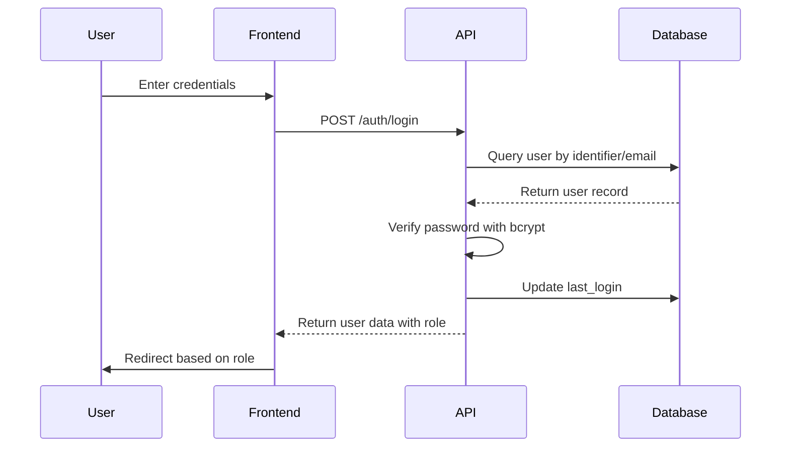

## Overview

SESA implements a role-based authentication system with three distinct user roles: administrator, teacher, and student. The system supports login via ID or email, uses bcrypt for password hashing, and automatically creates temporary passwords for new students.

## User Roles

The system defines three roles in the database:

```python
class Role(Base):
    __tablename__ = "roles"

    id = Column(Integer, primary_key=True, autoincrement=True)
    name = Column(String(50), nullable=False, unique=True)
    description = Column(String(255), nullable=True)
```

### Role Types

<CodeGroup>

```sql Administrator
-- ID: 1
INSERT INTO roles (name, description) VALUES 
('administrador', 'Full system access with management capabilities');
```

```sql Teacher
-- ID: 2
INSERT INTO roles (name, description) VALUES 
('docente', 'Teaching staff with course management access');
```

```sql Student
-- ID: 3
INSERT INTO roles (name, description) VALUES 
('alumno', 'Student access to personal information and courses');
```

</CodeGroup>

## User Model

The User model defined in `/home/daytona/workspace/source/backend/app/models/user.py:1` stores authentication data:

```python
class User(Base):
    __tablename__ = "users"

    id = Column(BigInteger, primary_key=True, autoincrement=True)
    identifier = Column(String(50), nullable=False, unique=True)
    email = Column(String(150), nullable=False, unique=True)
    password_hash = Column(String(255), nullable=False)
    role_id = Column(Integer, ForeignKey("roles.id"), nullable=False)
    is_temp_password = Column(Boolean, server_default=text("TRUE"))
    created_at = Column(TIMESTAMP, server_default=text("CURRENT_TIMESTAMP"))
    last_login = Column(TIMESTAMP, nullable=True)

    role = relationship("Role")
```

<Note>
The `identifier` field stores the student matricula, teacher ID, or administrator username.
</Note>

## Login Process

### Flexible Login

Users can authenticate using either their identifier (matricula/ID) or email address:

```python
@router.post("/login", response_model=UserResponse)
def login(data: LoginRequest, db: Session = Depends(get_db)):
    generic_error = "ID o contraseña incorrectos"

    # Supports login by identifier or email
    user = (
        db.query(User)
        .filter(or_(User.identifier == data.identifier, User.email == data.identifier))
        .first()
    )

    if not user:
        raise HTTPException(status_code=401, detail=generic_error)

    if not verify_password(data.password, user.password_hash):
        raise HTTPException(status_code=401, detail=generic_error)
```

### Last Login Tracking

The system tracks when users last logged in:

```python
# Register last_login
user.last_login = datetime.utcnow()
db.commit()
db.refresh(user)

return user
```

<Warning>
The system returns a generic error message for both invalid user and incorrect password to prevent username enumeration attacks.
</Warning>

## Password Security

### Bcrypt Hashing

Passwords are hashed using bcrypt with automatic salt generation in `/home/daytona/workspace/source/backend/app/core/security.py:1`:

```python
import bcrypt

def get_password_hash(password: str) -> str:
    pwd_bytes = password.encode('utf-8')
    
    salt = bcrypt.gensalt()
    hashed = bcrypt.hashpw(pwd_bytes, salt)
    
    return hashed.decode('utf-8')

def verify_password(plain_password: str, hashed_password: str) -> bool:
    try:
        pwd_bytes = plain_password.encode('utf-8')
        hash_bytes = hashed_password.encode('utf-8')
        
        return bcrypt.checkpw(pwd_bytes, hash_bytes)
    except Exception:
        return False
```

### Password Context Configuration

The student router also configures passlib for bcrypt:

```python
from passlib.context import CryptContext

pwd_context = CryptContext(
    schemes=["bcrypt"],
    deprecated="auto",
    bcrypt__ident="2b"
)
```

## Temporary Password System

### Automatic Generation for New Students

When a student is registered, the system generates a random 10-character temporary password:

```python
alphabet = string.ascii_letters + string.digits
raw_pass = ''.join(secrets.choice(alphabet) for _ in range(10))
hashed_pw = get_password_hash(raw_pass)

alumno_role = db.query(Role).filter(Role.name == 'alumno').first()
new_user = User(
    identifier=final_matricula,
    email=student_in.email_personal,
    password_hash=hashed_pw,
    role_id=alumno_role.id if alumno_role else 3,
    is_temp_password=True
)
db.add(new_user)
```

### Email Notification

The temporary password is sent to the student via email:

```python
cuerpo_html = f"""
<!DOCTYPE html>
<html>
<body style="font-family: 'Segoe UI', Tahoma, Geneva, Verdana, sans-serif; background-color: #f4f7f6; margin: 0; padding: 20px;">
    <div style="max-width: 600px; margin: 0 auto; background-color: #ffffff; border-radius: 8px; overflow: hidden; box-shadow: 0 4px 10px rgba(0,0,0,0.1);">
        <div style="background-color: #4f46e5; padding: 25px; text-align: center;">
            <h1 style="margin: 0; font-size: 24px; color: #ffffff;">Sistema Escolar SESA</h1>
        </div>
        <div style="padding: 30px; color: #374151; line-height: 1.6;">
            <h2 style="margin-top: 0; font-size: 20px; color: #111827;">¡Hola, {student_in.nombre}!</h2>
            <p style="font-size: 16px;">Tu alta se ha procesado exitosamente.</p>
            <div style="background-color: #f8fafc; border-left: 5px solid #4f46e5; padding: 20px; margin: 30px 0;">
                <p style="margin: 8px 0; font-size: 16px;"><strong>Matrícula:</strong> {final_matricula}</p>
                <p style="margin: 8px 0; font-size: 16px;"><strong>Contraseña:</strong> {raw_pass}</p>
            </div>
        </div>
    </div>
</body>
</html>
"""
```

<Note>
The `is_temp_password` flag indicates that the user must change their password on first login.
</Note>

## Password Change

Users can change their password through the `/auth/change-password` endpoint:

```python
@router.put("/change-password")
def change_password(data: PasswordChangeRequest, db: Session = Depends(get_db)):
    user = db.query(User).filter(User.identifier == data.identifier).first()
    if not user:
        raise HTTPException(status_code=404, detail="Usuario no encontrado")

    # Validate current password
    if not verify_password(data.current_password, user.password_hash):
        raise HTTPException(status_code=400, detail="La contraseña actual es incorrecta")

    # Confirm new password matches
    if data.new_password != data.confirm_password:
        raise HTTPException(status_code=400, detail="Las contraseñas no coinciden")

    # Prevent using same password
    if verify_password(data.new_password, user.password_hash):
        raise HTTPException(status_code=400, detail="La nueva contraseña no puede ser igual a la actual")

    # Update password
    user.password_hash = get_password_hash(data.new_password)
    user.is_temp_password = False

    db.commit()
    db.refresh(user)

    return {"message": "Contraseña actualizada exitosamente"}
```

### Password Change Validations

1. **Current Password**: User must provide correct current password
2. **Confirmation Match**: New password and confirmation must match
3. **Uniqueness**: New password cannot be the same as current password
4. **Temporary Flag**: Automatically cleared after successful change

## Authentication Flow



## Security Features

- **Bcrypt Hashing**: Industry-standard password hashing with automatic salt
- **Flexible Login**: Support for both identifier and email authentication
- **Generic Error Messages**: Prevent username enumeration
- **Temporary Password Tracking**: Flag for forcing password change
- **Last Login Tracking**: Audit trail for user access
- **Password Validation**: Multiple checks during password change
- **Secure Random Generation**: Uses `secrets` module for temporary passwords
- **Email Delivery**: Automatic notification with credentials