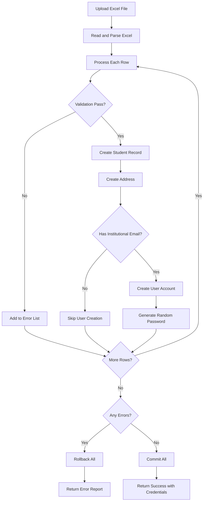

## Overview

The bulk import feature allows administrators to register multiple students simultaneously using Excel (.xlsx) files. The system performs extensive validation, detects duplicates both within the file and against existing database records, and provides detailed field-level error reporting.

## Excel File Format

The import endpoint expects an Excel file with the following columns:

| Column Name | Required | Format | Description |
|------------|----------|--------|-------------|
| Matrícula | Yes | 8 digits | Student ID (must be unique) |
| Nombre | Yes | Letters only | First name |
| Apellido Paterno | No | Letters only | Paternal surname |
| Apellido Materno | No | Letters only | Maternal surname |
| Curp | Yes | 18 characters | Mexican national ID (unique) |
| Correo Personal | No | Valid email | Personal email (unique) |
| Correo Institucional | No | @red.unid.mx | Institutional email (unique) |
| Carrera | Yes | Career name/ID | Must exist in database |
| Procedencia | Yes | School name | Origin school (must exist) |
| Cuatrimestre | No | 1-10 | Current semester (default: 1) |
| Promedio General | No | 0-10 | Integer GPA (default: 0) |
| Estatus | No | Text | Status name (default: activo) |
| Calle | No | Text | Street address |
| Número de domicilio | No | Text | Street number |
| Colonia | No | Text | Neighborhood |
| Código Postal | No | 5 digits | Postal code |
| Municipio | No | Letters only | Municipality |
| Estado | No | Text | State (default: Campeche) |

## Import Endpoint

The `/alumnos/importar` endpoint handles bulk student imports:

```python
@router.post("/importar")
async def importar_alumnos(file: UploadFile = File(...), db: Session = Depends(get_db)):
    if not file.filename.endswith('.xlsx'):
        raise HTTPException(status_code=400, detail="Error: Solo se permiten archivos .xlsx")

    content = await file.read()
    df = pd.read_excel(io.BytesIO(content))
    df.columns = [c.replace(':', '').strip() for c in df.columns]
```

<Warning>
Only .xlsx Excel files are accepted. Legacy .xls format is not supported.
</Warning>

## Validation Rules

### Matricula Validation

```python
matricula_str = str(row.get('Matrícula', '')).strip()
if matricula_str.endswith('.0'): matricula_str = matricula_str[:-2]

if not re.match(r'^\d{8}$', matricula_str):
    errores_fila.append("La matrícula debe tener exactamente 8 dígitos numéricos")
    campos_error.append("Matrícula")
elif matricula_str in matriculas_vistas:
    errores_fila.append("Matrícula duplicada en este mismo archivo Excel")
    campos_error.append("Matrícula")
elif db.query(Student).filter(Student.matricula == matricula_str).first():
    errores_fila.append("La matrícula ya existe en la base de datos")
    campos_error.append("Matrícula")
```

### Name Validation

```python
regex_solo_letras = r'^[A-Za-záéíóúÁÉÍÓÚñÑüÜ\s]+$'

if not nombre or nombre == 'nan':
    errores_fila.append("El nombre no puede estar vacío")
    campos_error.append("Nombre")
elif not re.match(regex_solo_letras, nombre):
    errores_fila.append("El nombre no debe contener números ni símbolos")
    campos_error.append("Nombre")
```

### CURP Validation

```python
regex_curp = r'^[A-Z]{4}\d{6}[HM][A-Z]{5}[A-Z0-9]\d$'

curp_str = str(row.get('Curp', '')).strip().upper()
if not curp_str or curp_str == 'nan':
    errores_fila.append("El CURP es obligatorio")
    campos_error.append("Curp")
elif len(curp_str) != 18 or not re.match(regex_curp, curp_str):
    errores_fila.append("Formato de CURP inválido (Deben ser 18 caracteres reales)")
    campos_error.append("Curp")
elif curp_str in curps_vistos:
    errores_fila.append("CURP duplicado en este mismo archivo Excel")
    campos_error.append("Curp")
elif db.query(Student).filter(Student.curp == curp_str).first():
    errores_fila.append(f"El CURP {curp_str} ya está registrado")
    campos_error.append("Curp")
```

### Email Validation

<CodeGroup>

```python Personal Email
regex_email_pers = r'^[a-zA-Z0-9_.+-]+@[a-zA-Z0-9-]+\.[a-zA-Z0-9-.]+$'

if email_pers and email_pers != 'nan':
    if not re.match(regex_email_pers, email_pers):
        errores_fila.append("Formato de correo personal inválido")
        campos_error.append("Correo Personal")
    elif email_pers in correos_pers_vistos:
        errores_fila.append("Correo personal duplicado en este mismo Excel")
        campos_error.append("Correo Personal")
    elif db.query(Student).filter(Student.email_personal == email_pers).first():
        errores_fila.append("Este correo personal ya está en uso")
        campos_error.append("Correo Personal")
```

```python Institutional Email
regex_email_inst = r'^[a-zA-Z0-9_.+-]+@red\.unid\.mx$'

if email_inst and email_inst != 'nan':
    if not re.match(regex_email_inst, email_inst):
        errores_fila.append("El correo institucional debe pertenecer al dominio @red.unid.mx")
        campos_error.append("Correo Institucional")
    elif email_inst in correos_inst_vistos:
        errores_fila.append("Correo institucional duplicado en este mismo Excel")
        campos_error.append("Correo Institucional")
```

</CodeGroup>

### Additional Validations

```python
# Postal code: exactly 5 digits
regex_cp = r'^\d{5}$'

# Semester: 1-10
if not cuat_str.isdigit() or not (1 <= int(cuat_str) <= 10):
    errores_fila.append("El cuatrimestre debe ser un número del 1 al 10")

# GPA: 0-10 (integer only)
if not promedio_str.isdigit() or not (0 <= int(promedio_str) <= 10):
    errores_fila.append("El promedio debe ser un número entero del 0 al 10")
```

## Duplicate Detection

### Within-File Duplicates

The system tracks values within the Excel file to prevent duplicates:

```python
matriculas_vistas = set()
curps_vistos = set()
correos_inst_vistos = set()
correos_pers_vistos = set()
nombres_completos_vistos = set()

# During processing
matriculas_vistas.add(matricula_str)
curps_vistos.add(curp_str)
correos_pers_vistos.add(email_pers)
correos_inst_vistos.add(email_inst)
```

### Full Name Duplicate Detection

The system also checks for exact name matches:

```python
nombre_completo_norm = f"{nombre} {ap_pat_limpio} {ap_mat_limpio}".lower()
nombre_completo_norm = " ".join(nombre_completo_norm.split())

if nombre_completo_norm in nombres_completos_vistos:
    errores_fila.append("Este nombre completo (nombre y apellidos) está duplicado en el archivo Excel")
else:
    existe_homonimo = db.query(Student).filter(
        func.lower(func.trim(Student.nombre)) == nombre.lower(),
        func.lower(func.trim(Student.apellido_paterno)) == ap_pat_limpio.lower(),
        func.lower(func.trim(Student.apellido_materno)) == ap_mat_limpio.lower()
    ).first()

    if existe_homonimo:
        errores_fila.append("Ya existe un alumno registrado exactamente con este mismo nombre y apellidos")
```

## Error Reporting System

When validation fails, the system provides detailed error information:

```python
if errores_fila:
    campos_error = list(set(campos_error))
    errores_validacion.append({
        "fila": fila_excel,
        "matricula": matricula_str,
        "nombre": nombre,
        "campos": campos_error,
        "mensajes": errores_fila
    })
    continue
```

### Error Response Format

```json
{
  "detail": "Las filas 3, 7, 12 no pasaron el sistema de validación. Por favor descargue el reporte, revise y vuelva a intentar.",
  "errores_detalle": [
    {
      "fila": 3,
      "matricula": "20240015",
      "nombre": "María",
      "campos": ["CURP", "Correo Personal"],
      "mensajes": [
        "Formato de CURP inválido (Deben ser 18 caracteres reales)",
        "Este correo personal ya está en uso"
      ]
    },
    {
      "fila": 7,
      "matricula": "20240020",
      "nombre": "Carlos",
      "campos": ["Matrícula"],
      "mensajes": [
        "La matrícula ya existe en la base de datos"
      ]
    }
  ]
}
```

<Note>
If ANY row fails validation, the entire import is rolled back. No partial imports are allowed.
</Note>

## Automatic User Creation

For students with institutional email, the system automatically creates user accounts:

```python
if email_inst and email_inst != 'nan':
    caracteres = string.ascii_letters + string.digits
    password_aleatoria = ''.join(secrets.choice(caracteres) for _ in range(10))

    nuevo_usuario = User(
        identifier=matricula_str,
        email=email_inst,
        password_hash=pwd_context.hash(password_aleatoria),
        role_id=alumno_role.id if alumno_role else 3,
        is_temp_password=True
    )
    db.add(nuevo_usuario)

    credenciales_generadas.append({
        "nombre": f"{nombre} {ap_pat_limpio}",
        "usuario": matricula_str,
        "password": password_aleatoria,
        "correo": email_inst
    })
```

## Address Creation

Student addresses are automatically created from Excel data:

```python
nueva_direccion = StudentAddress(
    student_matricula=matricula_str,
    calle=str(row.get('Calle', '')).strip(),
    numero_domicilio=str(row.get('Número de domicilio') or 'S/N'),
    colonia=str(row.get('Colonia', '')).strip(),
    codigo_postal=cp_str,
    municipio=municipio_str,
    estado=str(row.get('Estado', 'Campeche')).strip()
)
db.add(nueva_direccion)
```

## Success Response

When import succeeds, the response includes generated credentials:

```json
{
  "message": "45 alumnos y usuarios creados correctamente.",
  "data": [
    {
      "nombre": "Juan Pérez",
      "usuario": "20240015",
      "password": "aB3dE9fG2h",
      "correo": "juan.perez@red.unid.mx"
    }
  ]
}
```

## Import Flow



## Best Practices

1. **Validate Excel Locally**: Check format before uploading
2. **Remove Test Data**: Ensure no duplicate entries exist
3. **Verify Career Names**: Match exact names from database
4. **Check Email Domains**: Institutional emails must use @red.unid.mx
5. **Proper CURP Format**: Must be exactly 18 uppercase characters
6. **Complete Required Fields**: Matricula, Nombre, CURP, Carrera, and Procedencia
7. **Integer Values**: Remove decimals from Cuatrimestre and Promedio
8. **Save Credentials**: Export the generated passwords immediately after import