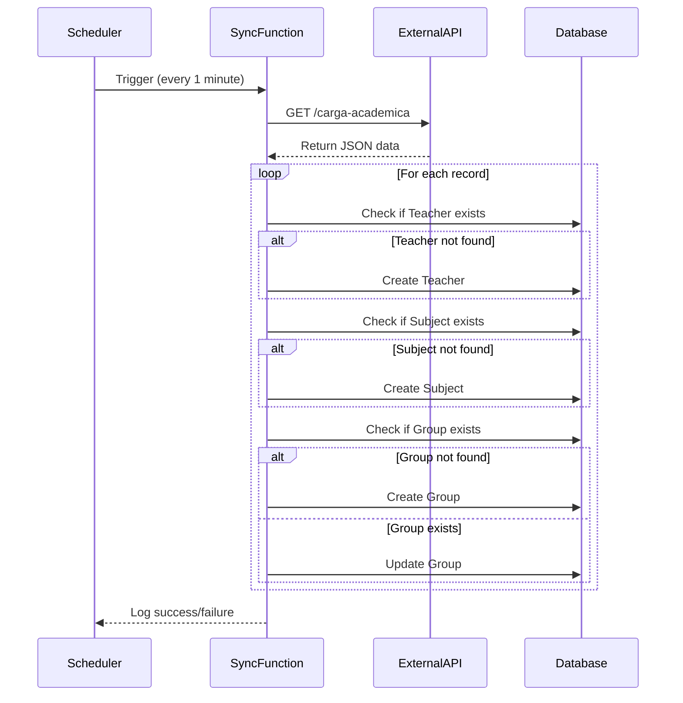

## Overview

SESA implements an automated data synchronization system that runs as a background job, periodically fetching teacher, subject, and academic group data from external APIs. This ensures the system stays up-to-date with external academic management systems.

## Scheduler Configuration

The synchronization is configured using APScheduler in `/home/daytona/workspace/source/backend/app/main.py:1`:

```python
from contextlib import asynccontextmanager
from fastapi import FastAPI
from apscheduler.schedulers.background import BackgroundScheduler
from app.routers.sync import tarea_automatica_sincronizacion

@asynccontextmanager
async def lifespan(app: FastAPI):
    scheduler = BackgroundScheduler()
    scheduler.add_job(tarea_automatica_sincronizacion, 'interval', minutes=1)
    scheduler.start()
    print("Cronjob de Sincronización Iniciado (Corriendo cada 1 minuto)")

    yield

    scheduler.shutdown()
    print("Cronjob de Sincronización Detenido")

app = FastAPI(
    title="SESA API",
    version="1.0.0",
    lifespan=lifespan
)
```

<Note>
The scheduler uses FastAPI's lifespan context manager to ensure proper startup and shutdown.
</Note>

## Synchronization Interval

The system runs every **1 minute** by default:

```python
scheduler.add_job(tarea_automatica_sincronizacion, 'interval', minutes=1)
```

<Warning>
Running synchronization every minute may be too frequent for production. Consider adjusting to 15-30 minutes based on data update frequency.
</Warning>

## Synchronization Function

The core synchronization logic is implemented in `/home/daytona/workspace/source/backend/app/routers/sync.py:1`:

```python
from fastapi import APIRouter
from sqlalchemy.orm import Session
import requests
from app.db.database import SessionLocal 
from app.models.teacher import Teacher
from app.models.subject import Subject
from app.models.academic_group import AcademicGroup

URL_API_DOCENTES = "http://127.0.0.1:8000/api-externa-mock/carga-academica"

def tarea_automatica_sincronizacion():
    db = SessionLocal()
    try:
        respuesta = requests.get(URL_API_DOCENTES)
        if respuesta.status_code != 200:
            print("❌ Error: API de Docentes no disponible")
            return

        datos = respuesta.json()
        registros_procesados = 0
```

## External API Integration

The system connects to an external API endpoint:

```python
URL_API_DOCENTES = "http://127.0.0.1:8000/api-externa-mock/carga-academica"

respuesta = requests.get(URL_API_DOCENTES)
if respuesta.status_code != 200:
    print("❌ Error: API de Docentes no disponible")
    return

datos = respuesta.json()
```

### Expected API Response Format

```json
[
  {
    "ID_Docente": "DOC001",
    "Nombre_Docente": "Juan",
    "Apellido_Paterno": "Pérez",
    "Apellido_Materno": "García",
    "ID_Materia": "MAT101",
    "Nombre_Materia": "Cálculo Diferencial",
    "Cuatrimestre": 1,
    "Creditos": 8,
    "ID_Carrera": 1,
    "Periodo": "2024-1",
    "Identificador_Grupo": "A",
    "Horarios": "{\"lunes\": \"08:00-10:00\", \"miercoles\": \"08:00-10:00\"}",
    "Cupo_Maximo": 30
  }
]
```

## Synchronization Process

### 1. Teacher Synchronization

Teachers are created or retrieved based on external ID:

```python
for item in datos:
    docente = db.query(Teacher).filter(Teacher.external_id == item["ID_Docente"]).first()
    if not docente:
        docente = Teacher(
            external_id=item["ID_Docente"],
            nombre=item["Nombre_Docente"],
            apellido_paterno=item["Apellido_Paterno"],
            apellido_materno=item["Apellido_Materno"]
        )
        db.add(docente)
        db.commit()
        db.refresh(docente)
```

### 2. Subject Synchronization

Subjects are linked to careers and semesters:

```python
materia = db.query(Subject).filter(Subject.external_id == item["ID_Materia"]).first()
if not materia:
    materia = Subject(
        external_id=item["ID_Materia"],
        nombre=item["Nombre_Materia"],
        cuatrimestre=item["Cuatrimestre"],
        creditos=item["Creditos"],
        career_id=item["ID_Carrera"]
    )
    db.add(materia)
    db.commit()
    db.refresh(materia)
```

### 3. Academic Group Synchronization

Groups connect teachers, subjects, and scheduling:

```python
grupo = db.query(AcademicGroup).filter(
    AcademicGroup.periodo == item["Periodo"],
    AcademicGroup.identificador_grupo == item["Identificador_Grupo"],
    AcademicGroup.subject_id == materia.id,
    AcademicGroup.teacher_id == docente.id
).first()

if not grupo:
    grupo = AcademicGroup(
        subject_id=materia.id,
        teacher_id=docente.id,
        periodo=item["Periodo"],
        identificador_grupo=item["Identificador_Grupo"],
        horario_json=item["Horarios"],
        cupo_maximo=item["Cupo_Maximo"]
    )
    db.add(grupo)
else:
    # Update existing group
    grupo.horario_json = item["Horarios"]
    grupo.cupo_maximo = item["Cupo_Maximo"]

db.commit()
registros_procesados += 1
```

<Note>
Existing groups are updated with new schedule and capacity information, while maintaining their relationships.
</Note>

## Error Handling

The synchronization includes comprehensive error handling:

```python
try:
    respuesta = requests.get(URL_API_DOCENTES)
    # ... synchronization logic
    print(f"✅ Sincronización Automática Exitosa: {registros_procesados} registros procesados.")
except Exception as e:
    print(f"❌ Error en Sincronización Automática: {e}")
finally:
    db.close()
```

## Manual Synchronization

Administrators can trigger synchronization manually via API:

```python
router = APIRouter(
    prefix="/sincronizacion",
    tags=["Sincronización Automática"]
)

@router.post("/ejecutar")
def sincronizar_datos_manual():
    tarea_automatica_sincronizacion()
    return {"mensaje": "Sincronización manual disparada con éxito. Revisa la consola."}
```

### Example Request

```bash
curl -X POST http://localhost:8000/sincronizacion/ejecutar
```

### Example Response

```json
{
  "mensaje": "Sincronización manual disparada con éxito. Revisa la consola."
}
```

## Synchronization Flow



## Database Models

### Teacher Model

```python
class Teacher(Base):
    __tablename__ = "teachers"
    
    id = Column(Integer, primary_key=True)
    external_id = Column(String(50), unique=True)
    nombre = Column(String(100))
    apellido_paterno = Column(String(100))
    apellido_materno = Column(String(100))
```

### Subject Model

```python
class Subject(Base):
    __tablename__ = "subjects"
    
    id = Column(Integer, primary_key=True)
    external_id = Column(String(50), unique=True)
    nombre = Column(String(200))
    cuatrimestre = Column(Integer)
    creditos = Column(Integer)
    career_id = Column(Integer, ForeignKey("careers.id"))
```

### Academic Group Model

```python
class AcademicGroup(Base):
    __tablename__ = "academic_groups"
    
    id = Column(Integer, primary_key=True)
    subject_id = Column(Integer, ForeignKey("subjects.id"))
    teacher_id = Column(Integer, ForeignKey("teachers.id"))
    periodo = Column(String(20))
    identificador_grupo = Column(String(10))
    horario_json = Column(Text)
    cupo_maximo = Column(Integer)
```

## Monitoring and Logging

The synchronization provides console logging:

```python
# On startup
print("Cronjob de Sincronización Iniciado (Corriendo cada 1 minuto)")

# On success
print(f"✅ Sincronización Automática Exitosa: {registros_procesados} registros procesados.")

# On error
print(f"❌ Error en Sincronización Automática: {e}")

# On shutdown
print("Cronjob de Sincronización Detenido")
```

<Note>
For production environments, consider using proper logging frameworks instead of print statements.
</Note>

## Configuration Recommendations

### Production Settings

```python
# Adjust interval based on data update frequency
scheduler.add_job(
    tarea_automatica_sincronizacion, 
    'interval', 
    minutes=30  # Changed from 1 to 30
)
```

### External API Configuration

```python
# Use environment variables for API URL
import os

URL_API_DOCENTES = os.getenv(
    "EXTERNAL_API_URL",
    "http://127.0.0.1:8000/api-externa-mock/carga-academica"
)
```

### Timeout Configuration

```python
# Add timeout to prevent hanging
respuesta = requests.get(URL_API_DOCENTES, timeout=30)
```

## Benefits

1. **Automatic Updates**: No manual intervention required
2. **Consistency**: Ensures SESA stays synchronized with external systems
3. **Reliability**: Background job survives application restarts
4. **Flexibility**: Manual trigger available for immediate sync
5. **Error Resilience**: Failures logged without crashing application
6. **Data Integrity**: Uses database transactions for consistency

## Future Enhancements

- Add retry logic for failed synchronizations
- Implement differential sync (only changes)
- Add metrics and monitoring
- Support multiple external API sources
- Implement conflict resolution strategies
- Add webhook support for real-time updates