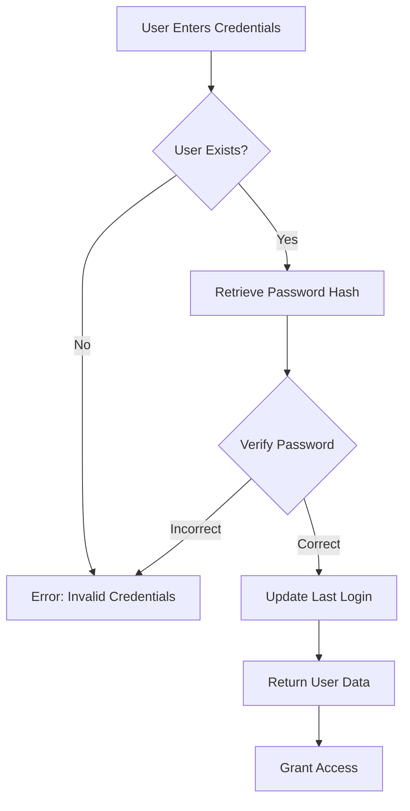

# Password Management

This guide covers password management in the SESA system, including temporary passwords, changing passwords, and security best practices.

## Temporary Password System

SESA uses a temporary password system to ensure security for new users.

### How It Works

<Steps>
  <Step title="Administrator Registers Student">
    When a student is registered (manually or via bulk import), the system automatically:
    1. Generates a random 10-character password
    2. Uses a secure character set (letters + digits)
    3. Hashes the password with bcrypt
    4. Sets the `is_temp_password` flag to `true`
  </Step>
  
  <Step title="Credentials Delivery">
    The system sends credentials to the student via email:
    - Matriculation number (8 digits)
    - Temporary password
    - Welcome message and instructions
  </Step>
  
  <Step title="First Login">
    The student uses the temporary password to access the system for the first time.
  </Step>
  
  <Step title="Password Change Required">
    For security, students should change their temporary password immediately after first login.
  </Step>
</Steps>

### Password Generation Algorithm

```python
import secrets
import string

# Character set: uppercase, lowercase, and digits
alphabet = string.ascii_letters + string.digits

# Generate 10 random characters
raw_pass = ''.join(secrets.choice(alphabet) for _ in range(10))

# Example output: "aB3xK9mP2q"
```

<Note>
  The `secrets` module is used instead of `random` for cryptographically secure random generation.
</Note>

### Temporary Password Characteristics

<Check>
  - **Length**: Exactly 10 characters
  - **Character types**: Letters (a-z, A-Z) and digits (0-9)
  - **Randomness**: Cryptographically secure
  - **Uniqueness**: Different for each user
  - **Security**: Immediately hashed with bcrypt before storage
</Check>

---

## Password Change Flow

Users can change their password through the authentication endpoint.

### Endpoint: `/auth/change-password`

**Method**: PUT

**Request Body** (JSON):

```json
{
  "identifier": "20240002",
  "current_password": "aB3xK9mP2q",
  "new_password": "MyNewSecurePass123",
  "confirm_password": "MyNewSecurePass123"
}
```

**Required Fields:**
- `identifier`: Student matriculation number
- `current_password`: Current password (for identity verification)
- `new_password`: Desired new password
- `confirm_password`: New password repeated for confirmation

### Complete Password Change Process

<Steps>
  <Step title="User Initiates Change">
    Navigate to the password change form in the portal or application.
  </Step>
  
  <Step title="Enter Current Password">
    Provide your current password to verify your identity.
    
    <Warning>
      The system will reject the request if the current password is incorrect.
    </Warning>
  </Step>
  
  <Step title="Enter New Password">
    Choose a strong, secure password that:
    - Is different from your current password
    - Meets any institutional password policies
    - Is memorable but not easily guessed
  </Step>
  
  <Step title="Confirm New Password">
    Re-enter the new password to prevent typos.
    
    <Note>
      Both password fields must match exactly.
    </Note>
  </Step>
  
  <Step title="Submit Request">
    Send the password change request to the server.
  </Step>
  
  <Step title="System Validates">
    The server performs validation checks (see below).
  </Step>
  
  <Step title="Password Updated">
    If valid, the password is updated and the `is_temp_password` flag is set to `false`.
  </Step>
</Steps>

---

## Validation Rules

The system enforces strict validation to ensure password security.

### 1. User Existence Check

```python
user = db.query(User).filter(User.identifier == data.identifier).first()
if not user:
    raise HTTPException(status_code=404, detail="Usuario no encontrado")
```

<Warning>
  **Error**: "Usuario no encontrado"
  
  The specified matriculation number doesn't exist in the system.
</Warning>

### 2. Current Password Verification

```python
if not verify_password(data.current_password, user.password_hash):
    raise HTTPException(status_code=400, detail="La contraseña actual es incorrecta")
```

<Warning>
  **Error**: "La contraseña actual es incorrecta"
  
  The provided current password doesn't match the stored hash.
</Warning>

**Security Note:** This validation ensures that only the legitimate user can change the password, even if someone gains access to the account.

### 3. Confirmation Matching

```python
if data.new_password != data.confirm_password:
    raise HTTPException(status_code=400, detail="Las contraseñas no coinciden")
```

<Warning>
  **Error**: "Las contraseñas no coinciden"
  
  The new password and confirmation don't match.
</Warning>

**Purpose:** Prevents accidental password changes due to typos.

### 4. New Password Different from Current

```python
if verify_password(data.new_password, user.password_hash):
    raise HTTPException(status_code=400, detail="La nueva contraseña no puede ser igual a la actual")
```

<Warning>
  **Error**: "La nueva contraseña no puede ser igual a la actual"
  
  The new password is identical to the current password.
</Warning>

**Security Rationale:** Forces users to actually change their password rather than reusing the same one, especially important when changing temporary passwords.

---

## API Request/Response Examples

### Successful Password Change

**Request:**

```bash
curl -X PUT https://api.sesa.edu.mx/auth/change-password \
  -H "Content-Type: application/json" \
  -d '{
    "identifier": "20240002",
    "current_password": "aB3xK9mP2q",
    "new_password": "MyNewSecurePass123",
    "confirm_password": "MyNewSecurePass123"
  }'
```

**Response (200 OK):**

```json
{
  "message": "Contraseña actualizada exitosamente"
}
```

<Tip>
  After successful password change, the user can immediately log in with the new password.
</Tip>

### Error: Wrong Current Password

**Request:**

```json
{
  "identifier": "20240002",
  "current_password": "WrongPassword123",
  "new_password": "MyNewSecurePass123",
  "confirm_password": "MyNewSecurePass123"
}
```

**Response (400 Bad Request):**

```json
{
  "detail": "La contraseña actual es incorrecta"
}
```

### Error: Passwords Don't Match

**Request:**

```json
{
  "identifier": "20240002",
  "current_password": "aB3xK9mP2q",
  "new_password": "MyNewSecurePass123",
  "confirm_password": "DifferentPassword456"
}
```

**Response (400 Bad Request):**

```json
{
  "detail": "Las contraseñas no coinciden"
}
```

### Error: Same Password as Current

**Request:**

```json
{
  "identifier": "20240002",
  "current_password": "aB3xK9mP2q",
  "new_password": "aB3xK9mP2q",
  "confirm_password": "aB3xK9mP2q"
}
```

**Response (400 Bad Request):**

```json
{
  "detail": "La nueva contraseña no puede ser igual a la actual"
}
```

### Error: User Not Found

**Request:**

```json
{
  "identifier": "99999999",
  "current_password": "aB3xK9mP2q",
  "new_password": "MyNewSecurePass123",
  "confirm_password": "MyNewSecurePass123"
}
```

**Response (404 Not Found):**

```json
{
  "detail": "Usuario no encontrado"
}
```

---

## Password Hashing and Security

SESA uses industry-standard security practices for password storage.

### Hashing Algorithm: bcrypt

```python
from passlib.context import CryptContext

pwd_context = CryptContext(
    schemes=["bcrypt"],
    deprecated="auto",
    bcrypt__ident="2b"
)

# Hashing a password
hashed = pwd_context.hash(raw_password)

# Verifying a password
is_valid = pwd_context.verify(plain_password, hashed_password)
```

### Security Features

<CardGroup cols={2}>
  <Card title="Salt" icon="salt-shaker">
    Unique salt per password prevents rainbow table attacks
  </Card>
  
  <Card title="Cost Factor" icon="gauge-high">
    Computational cost makes brute-force attacks impractical
  </Card>
  
  <Card title="One-Way Function" icon="arrow-right">
    Impossible to reverse hash back to original password
  </Card>
  
  <Card title="Secure Storage" icon="lock">
    Only hashed passwords stored, never plaintext
  </Card>
</CardGroup>

### What Gets Stored in the Database

**User Table:**

| Column | Example Value | Description |
|--------|---------------|-------------|
| identifier | 20240002 | Student matriculation |
| email | student@red.unid.mx | Institutional email |
| password_hash | $2b$12$K8... | Bcrypt hash (60 chars) |
| is_temp_password | true | Temporary password flag |
| role_id | 3 | Role: alumno |

<Note>
  The actual password is NEVER stored. Only the bcrypt hash is saved.
</Note>

---

## Security Best Practices

### For Students

<Check>
  **Do:**
  - Change your temporary password immediately after first login
  - Use a strong, unique password
  - Never share your password with anyone
  - Log out after using public computers
  - Use a password manager if needed
</Check>

<Warning>
  **Don't:**
  - Reuse passwords from other websites
  - Share passwords via email or messaging
  - Write passwords on paper
  - Use easily guessable passwords (birthdays, names)
  - Save passwords on shared computers
</Warning>

### For Administrators

<Check>
  **Do:**
  - Encourage students to change temporary passwords
  - Maintain secure processes for credential distribution
  - Use secure channels for password resets
  - Monitor for suspicious login activity
  - Keep email systems secure
</Check>

<Warning>
  **Don't:**
  - Share temporary passwords over insecure channels
  - Store plaintext passwords anywhere
  - Bypass the password change validation
  - Access student accounts without authorization
  - Ignore reports of compromised accounts
</Warning>

---

## Password Policy Recommendations

While SESA currently validates basic password requirements, consider implementing additional policies:

### Recommended Requirements

```yaml
Minimum Length: 10 characters
Character Types:
  - At least one uppercase letter
  - At least one lowercase letter
  - At least one number
  - At least one special character (optional)
  
Prohibited:
  - Common passwords (e.g., "Password123")
  - Sequential characters (e.g., "12345", "abcde")
  - Personal information (name, birthdate, matriculation)
  
Expiration:
  - Temporary passwords: Change on first login (enforced)
  - Regular passwords: Optional 90-day expiration
  
History:
  - Cannot reuse last 5 passwords
```

<Tip>
  These are recommendations for institutional policy. Consult with your security team before implementing password requirements.
</Tip>

---

## Password Recovery Process

Currently, password recovery requires administrator intervention.

### For Students

<Steps>
  <Step title="Contact Administrator">
    If you forget your password, contact your academic administrator.
  </Step>
  
  <Step title="Verify Identity">
    Provide identification (student ID, official documentation) to verify your identity.
  </Step>
  
  <Step title="Administrator Resets Password">
    The administrator generates a new temporary password for you.
  </Step>
  
  <Step title="Receive New Credentials">
    Get your new temporary password via secure channel.
  </Step>
  
  <Step title="Log In and Change">
    Use the temporary password to log in, then immediately change it.
  </Step>
</Steps>

### For Administrators

<Note>
  Password reset functionality for administrators is not currently implemented via API. Consider these approaches:
  
  1. **Database Access**: Directly update the user's password_hash and set is_temp_password = true
  2. **Re-registration**: Create a new user account (if institutional policy allows)
  3. **Custom Tool**: Develop an admin interface for password resets
</Note>

---

## Integration with Login System

Password changes integrate seamlessly with the login flow.

### Login Process with Password Verification

```python
@router.post("/login", response_model=UserResponse)
def login(data: LoginRequest, db: Session = Depends(get_db)):
    # Support login by identifier or email
    user = (
        db.query(User)
        .filter(or_(User.identifier == data.identifier, User.email == data.identifier))
        .first()
    )

    if not user:
        raise HTTPException(status_code=401, detail="ID o contraseña incorrectos")

    # Verify password against stored hash
    if not verify_password(data.password, user.password_hash):
        raise HTTPException(status_code=401, detail="ID o contraseña incorrectos")

    # Update last login timestamp
    user.last_login = datetime.utcnow()
    db.commit()

    return user
```

### Password Verification Flow



---

## Common Issues and Solutions

### Issue: Forgot Temporary Password

**Symptoms:**
- Never logged in before
- Lost the welcome email
- Can't access email account

**Solution:**
1. Check spam/junk folders thoroughly
2. Search email for "sesacorp10@gmail.com" or "SESA"
3. Contact administrator for credential resend
4. Verify correct email address was used during registration

### Issue: Current Password Rejected During Change

**Symptoms:**
- Error: "La contraseña actual es incorrecta"
- Sure the password is correct

**Solution:**
1. Check for typos and case sensitivity
2. Ensure no extra spaces before/after password
3. Verify using the most recent password (if changed before)
4. Contact administrator if locked out

### Issue: Can't Use Desired New Password

**Symptoms:**
- Error: "La nueva contraseña no puede ser igual a la actual"

**Solution:**
1. Choose a completely different password
2. Ensure new password doesn't match current one
3. Don't try to reuse the temporary password

### Issue: Passwords Don't Match Error

**Symptoms:**
- Error: "Las contraseñas no coinciden"
- Typed password carefully

**Solution:**
1. Copy and paste both fields to ensure matching
2. Check for typos in confirmation field
3. Use "show password" feature if available
4. Type slowly and verify each character

---

## Technical Reference

### Password Change Schema

```python
from pydantic import BaseModel

class PasswordChangeRequest(BaseModel):
    identifier: str          # Student matriculation number
    current_password: str    # Current password for verification
    new_password: str        # Desired new password
    confirm_password: str    # Confirmation of new password
```

### Response Codes

| Code | Meaning | Description |
|------|---------|-------------|
| 200 | OK | Password changed successfully |
| 400 | Bad Request | Validation error (passwords don't match, same password, etc.) |
| 404 | Not Found | User with specified identifier doesn't exist |
| 500 | Server Error | Database or system error |

### Security Headers

When implementing password change in a frontend:

```javascript
fetch('/auth/change-password', {
  method: 'PUT',
  headers: {
    'Content-Type': 'application/json',
    // Add authentication token if using JWT/sessions
  },
  body: JSON.stringify({
    identifier: '20240002',
    current_password: 'currentPass',
    new_password: 'newSecurePass',
    confirm_password: 'newSecurePass'
  })
})
```

---

## Quick Reference

### Endpoints

| Endpoint | Method | Purpose |
|----------|--------|----------|
| `/auth/login` | POST | Authenticate user |
| `/auth/change-password` | PUT | Change user password |

### Key Concepts

| Term | Definition |
|------|------------|
| Temporary Password | Auto-generated 10-char password for new users |
| Password Hash | Bcrypt-encrypted password stored in database |
| is_temp_password | Flag indicating if password should be changed |
| Password Verification | Comparing plaintext against stored hash |

### Validation Sequence

1. ✓ User exists
2. ✓ Current password correct
3. ✓ New passwords match
4. ✓ New password different from current
5. ✓ Update password and flag

---

<Info>
  For more information about user authentication and system access, see the [Student Portal Guide](/guides/student-portal).
</Info>
