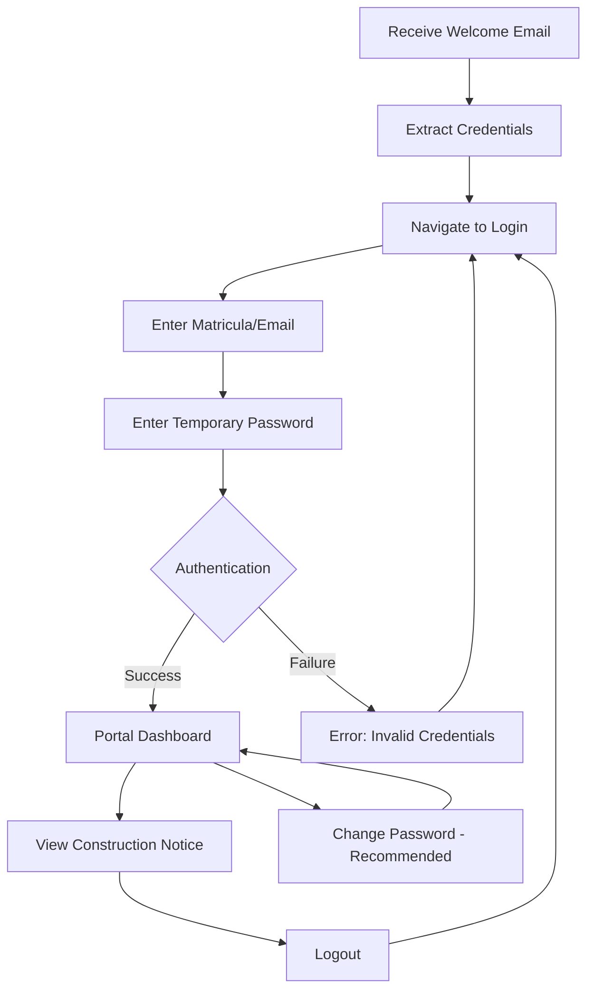

# Student Portal Guide

This guide helps students understand how to access their SESA portal, view their information, and navigate the system.

## Getting Started

### Receiving Your Credentials

When the administrator registers you in the system, you'll receive an automated email with your access credentials.

<Steps>
  <Step title="Check Your Inbox">
    Look for an email from `sesacorp10@gmail.com` with the subject:
    
    **"¡Bienvenido a SESA! Tu alta ha sido exitosa"**
  </Step>
  
  <Step title="Locate Your Credentials">
    The email contains:
    - **Matrícula**: Your unique 8-digit student ID number
    - **Contraseña**: Your temporary password (10 random characters)
    
    Example:
    ```
    Matrícula: 20240002
    Contraseña: aB3xK9mP2q
    ```
  </Step>
  
  <Step title="Save Your Information Securely">
    Store these credentials in a safe place. You'll need them to log in for the first time.
  </Step>
</Steps>

<Warning>
  **Didn't receive the email?**
  - Check your spam/junk folder
  - Verify the email address you provided during registration
  - Contact your administrator for credential recovery
</Warning>

### Email Format

The welcome email is formatted as follows:


**Email Structure:**
- Header: Blue banner with "Sistema Escolar SESA"
- Greeting: Personalized with your first name
- Credential box: Highlighted section with matriculation and password
- Professional styling with the institutional color scheme (#4f46e5)

---

## Logging In for the First Time

Access your student portal using the credentials provided in your welcome email.

<Steps>
  <Step title="Navigate to the Login Page">
    Open your web browser and go to the SESA login page.
  </Step>
  
  <Step title="Enter Your Credentials">
    In the login form:
    - **ID or Email**: Enter your matriculation number (e.g., `20240002`) or institutional email
    - **Password**: Enter the temporary password from the welcome email
    
    <Note>
      The system accepts either your matriculation number OR your institutional email as the identifier.
    </Note>
  </Step>
  
  <Step title="Click Login">
    Submit the form to access your portal.
  </Step>
  
  <Step title="Portal Welcome Screen">
    You'll see a personalized welcome message:
    
    **"¡Hola, [your-email]!"**
    **"Portal en Construcción"**
  </Step>
</Steps>

### Login Screen Overview

- **Field Labels**: "ID O CORREO" and "CONTRASEÑA"
- **Authentication**: The system verifies your credentials against the database
- **Session**: Your last login time is recorded for security purposes

<Tip>
  Bookmark the login page for quick access in the future!
</Tip>

---

## Portal Overview

Once logged in, you'll see the main student portal interface.

### Current Portal Status

<Info>
  The student module is currently under development. The portal displays:
  
  - Construction icon (hard hat symbol)
  - Welcome message with your email
  - Information about upcoming features
  - Logout button
</Info>

### Portal Interface Elements

**Header Section:**
- Blue circular icon with hard hat (construction indicator)
- Personalized greeting: "¡Hola, [your-email]!"
- Subtitle: "Portal en Construcción"

**Information Message:**
> "Estamos trabajando en el módulo de estudiantes de SESA para que pronto puedas consultar tu carga académica, calificaciones y estatus de manera sencilla. ¡Vuelve pronto!"

**Action Button:**
- Red logout button at the bottom
- Icon: Logout symbol
- Text: "Cerrar Sesión"

---

## Viewing Personal Information (Coming Soon)

<Note>
  The following features are planned for the student portal and will be available soon.
</Note>

### Profile Information

Once the portal is fully deployed, you'll be able to view:

**Personal Data:**
- Full name (nombre completo)
- CURP
- Personal and institutional email addresses
- Profile photo

**Academic Information:**
- Current career/program
- Origin school
- Current semester (cuatrimestre)
- Student status (activo/baja)
- GPA from previous institution

**Address Information:**
- Street and number
- Neighborhood (colonia)
- Postal code
- Municipality and state

---

## Accessing Academic Progress (Coming Soon)

Future portal features will include:

### Course Load (Carga Académica)

<CardGroup cols={2}>
  <Card title="Current Courses" icon="book-open">
    View all enrolled courses for the current semester
  </Card>
  
  <Card title="Course Schedule" icon="calendar">
    Access your class timetable and locations
  </Card>
  
  <Card title="Credits" icon="certificate">
    Track earned and required credits
  </Card>
  
  <Card title="Attendance" icon="clipboard-check">
    Monitor your attendance record
  </Card>
</CardGroup>

### Grades (Calificaciones)

- View grades by course and semester
- Calculate current GPA
- Review academic history
- Access grade reports

### Academic Status

- Enrollment status verification
- Academic standing
- Progress toward degree completion
- Pending requirements

---

## Accessing Uploaded Documents (Coming Soon)

Your administrator uploads important documents during registration.

### Available Documents

**Profile Photo:**
- Your official student photo
- Used for ID cards and system records
- Format: JPEG/PNG

**Certificate (Certificado):**
- Your secondary school certificate
- Academic credentials from previous institution
- Format: PDF

### Document Access

Documents will be accessible through the portal interface:

```
Endpoint: /alumnos/archivos/{file_id}
Response: File download with original name
```

<Tip>
  Documents are stored securely and can be downloaded or viewed directly in the browser.
</Tip>

---

## Changing Your Password

<Warning>
  You must change your temporary password on first use for security reasons.
</Warning>

### Password Change Process

<Steps>
  <Step title="Access Password Change">
    Navigate to the password change section in your portal.
  </Step>
  
  <Step title="Provide Current Password">
    Enter the temporary password you received via email.
  </Step>
  
  <Step title="Enter New Password">
    Choose a strong, secure password that:
    - Is different from your current password
    - Meets security requirements
    - Is memorable but not easily guessed
  </Step>
  
  <Step title="Confirm New Password">
    Re-enter your new password to ensure accuracy.
  </Step>
  
  <Step title="Submit Change">
    Click submit to update your password.
  </Step>
</Steps>

### Password Requirements

<Check>
  - Must be different from your current password
  - New password and confirmation must match
  - Cannot reuse the temporary password
  - Should be kept confidential
</Check>

<Info>
  For detailed information about password management, see the [Password Management Guide](/guides/password-management).
</Info>

---

## Logging Out

Always log out when you finish using the portal, especially on shared computers.

<Steps>
  <Step title="Click Logout Button">
    Find the "Cerrar Sesión" button (red with logout icon).
  </Step>
  
  <Step title="Session Terminated">
    You'll be redirected to the login page and your session will be cleared.
  </Step>
  
  <Step title="Close Browser">
    For added security, close your browser window.
  </Step>
</Steps>

<Warning>
  **Security Best Practices:**
  - Never share your password
  - Log out on public computers
  - Don't save passwords on shared devices
  - Report suspicious activity immediately
</Warning>

---

## User Flow Diagram

Here's a visual representation of the student portal user flow:



---

## Common Questions

### What if I forget my password?

Contact your administrator for a password reset. They can generate a new temporary password for you.

### Can I use my personal email to log in?

No. The system requires your matriculation number or institutional email (@red.unid.mx) for login.

### Why does the portal show "under construction"?

The student module is being actively developed. Core features for viewing academic information, grades, and course loads will be available soon.

### How do I update my personal information?

Contact your administrator to update information like your address or personal email. Students cannot directly edit their core records.

### What should I do if I see someone else's information?

Log out immediately and report this to your administrator. This could be a serious security issue.

---

## Getting Help

### Technical Support

If you experience issues:

1. **Login Problems**: Verify your credentials and contact your administrator
2. **Email Issues**: Check spam folders or request credential resend
3. **Browser Issues**: Try a different browser or clear cache
4. **System Errors**: Report to your administrator with error details

### Administrator Contact

Your academic administrator can help with:
- Credential recovery
- Information updates
- Document access
- General system questions

---

## What's Coming Next

<CardGroup cols={2}>
  <Card title="Full Portal Launch" icon="rocket">
    Complete student module with all features
  </Card>
  
  <Card title="Academic Dashboard" icon="chart-line">
    Visual representation of your academic progress
  </Card>
  
  <Card title="Document Management" icon="folder">
    Access and download your academic documents
  </Card>
  
  <Card title="Communication Tools" icon="messages">
    Message system for student-administrator contact
  </Card>
</CardGroup>

<Tip>
  Stay tuned for updates! The SESA development team is working to deliver a comprehensive student portal experience.
</Tip>

---

## Quick Reference

### Login Credentials

- **Username**: Matriculation number OR institutional email
- **Password**: Temporary password from welcome email (change immediately)

### Key Actions

| Action | Description |
|--------|-------------|
| Login | Enter credentials to access portal |
| View Portal | See welcome screen and construction notice |
| Logout | End session and return to login |
| Change Password | Update temporary password (recommended) |

### Important Links

- [Password Management Guide](/guides/password-management)
- [Administrator Guide](/guides/administrator-guide)
- [System Overview](/introduction)

<Info>
  This guide will be updated as new features become available in the student portal.
</Info>
